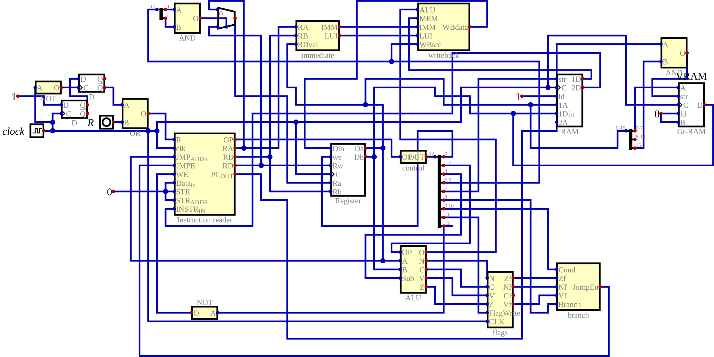
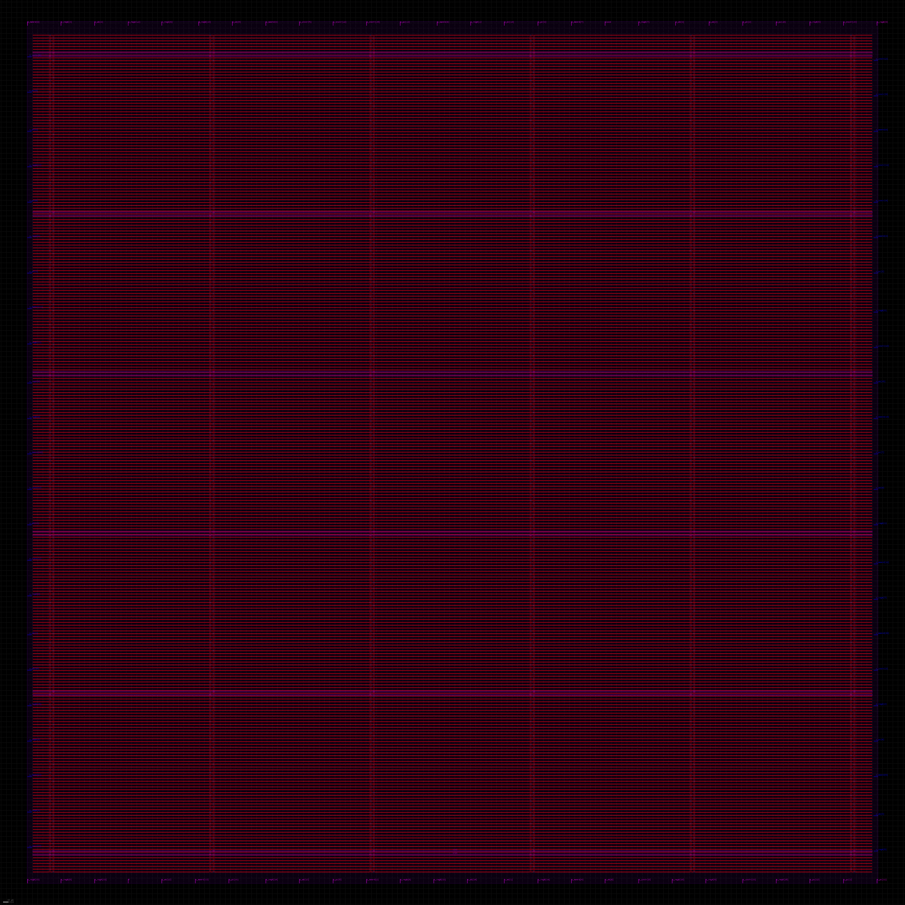
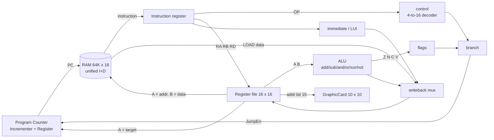

# custom-16bit-CPU

A 16-bit RISC CPU designed gate by gate in the [Digital](https://github.com/hneemann/Digital) logic simulator, starting from a single NAND gate, with an assembler, a Verilog export that runs real programs under Icarus Verilog, and a completed OpenLane/sky130 RTL-to-GDS run.

Part of a "transistors to transformers" body of work: this is the bottom layer. See also [mini-os32](https://github.com/Waelalzoub1/mini-os32) (an OS with a self-hosting C compiler) and [Transformer-character-level](https://github.com/Waelalzoub1/Transformer-character-level) (a transformer written from scratch in PyTorch).



## What is hand-built and what is not

Everything in the datapath and control path is composed from `NAND.dig`: 5,004 NAND gates in the `CPU.dig` hierarchy. `NAND_transistor.dig` is the same gate as 2 PFET + 2 NFET (4 transistors), so the hand-built logic is about 20,000 transistors (20,016).

A few pieces use Digital's built-in primitives instead of NAND, and the README says so because the "from one gate" claim should be checked, not taken on faith:

| Block | Built from NAND | Built-in primitives used |
|---|---|---|
| `ALU` (add/sub, AND, OR, XOR, NOT, flags) | 2,401 NAND | none |
| `Instruction reader` (PC, instruction register) | 1,888 NAND | none |
| `Register` (16-bit, from `flip-flop` from `D-latch`) | 752 NAND | none |
| `writeback`, `branch`, `immediate` | 480 + 49 + 0 NAND | none |
| `control` (opcode decoder) | 175 NAND | 10 `Or` gates |
| `flags` | 0 | 4 one-bit `Register` |
| `CPU.dig` top level | glue | `RegisterFile` (16 x 16), `RAMDualAccess` (64K x 16), `GraphicCard`, 2 `D_FF` (power-on reset), 1 `Multiplexer` |

`memory.dig` (a 16 x 16 register file built from `Register.dig`, 17,007 NAND) exists and simulates, but `CPU.dig` instantiates Digital's `RegisterFile` primitive instead so the full CPU simulates at usable speed. Counting the built-ins at standard CMOS equivalents, the CPU core is roughly 33,000 transistors (about 8,300 NAND-equivalents), excluding the 64K-word RAM. The counts come from walking the `.dig` XML: `python3 tools/count_nand.py`.

## Instruction set

Fixed 16-bit words, `OP[15:12] RD[11:8] RA[7:4] RB[3:0]`, 16 registers, 16 opcodes:

```
0 NOP   1 ADD   2 SUB   3 AND    4 OR    5 XOR   6 NOT   7 LOAD
8 STORE 9 LUI   A LDI   B JMP    C JEQ   D JNE   E JGT   F HLT
```

Memory and jump targets are register-indirect. There is no shift, multiply, or divide; the programs below build those from ADD. Flags (Z N C V) are latched only by ADD and SUB. The instruction after a taken branch always executes (a one-slot branch delay from the two-stage fetch/execute pipeline); the assembler inserts a NOP there automatically. Full details in [`ISA.md`](ISA.md).

Verified against the Verilog export in this audit (see `sim/`): LDI, LUI (preserves the low byte), ADD, SUB, AND, OR as MOV, LOAD, STORE, JEQ, JNE, JGT, and the delay slot all behave as `ISA.md` says.

`HLT` freezes the machine: the control unit's halt bit (bit 12), inverted, is the write-enable of both the program counter and the instruction register, so once an HLT is in the instruction register neither changes again. (An earlier revision computed the halt bit but left it unconnected, so HLT behaved as a NOP; the simulations below caught that.)

## Assembler

`asm/asm.py` implements [`ASSEMBLER_SPEC.md`](ASSEMBLER_SPEC.md): two passes, labels, `MOV`/`LI` pseudo-instructions, decimal/hex/binary literals, and automatic delay-slot NOPs. Output is Digital's `v2.0 raw` hex, loadable into the RAM of `CPU.dig`.

```bash
python3 asm/asm.py programs/fib.asm -o programs/fib.hex --listing
python3 asm/test_asm.py        # 9 unit tests, including the spec's worked example
```

One deliberate deviation from the spec's worked example: `LI Rd, label` always emits two words (`LDI` + `LUI`) so that label addresses are fixed before any label is resolved; numeric `LI` still emits one word when the value fits in 8 bits.

## Programs

| Program | What it does | Words | Cycles | Checked result |
|---|---|---|---|---|
| `programs/fib.asm` | Fibonacci F(0)..F(23) stored at 0x100.. | 17 | 202 | 24 memory words, R1 = F(24) = 46368 |
| `programs/mul.asm` | 123 x 45 by shift-and-add, doubling instead of shifting | 25 | 164 | R3 = MEM[0x200] = 5535 |
| `programs/sort.asm` | Bubble sort of 8 words at 0x300 | 52 | 385 | 1 2 3 4 6 7 8 9 |
| `programs/fb.asm` | Diagonal on the 10 x 10 framebuffer | 15 | 61 | 10 pixels at 0x8000 + 11*i |

Framebuffer mapping (from `CPU.dig`): a STORE whose address has bit 15 set also writes the `GraphicCard`, with the low 8 bits as pixel index `y*10 + x`. `CPU_export.v` has no GraphicCard, so in simulation those words land in RAM at the same addresses and the test asserts on them.

## Simulation

The same four programs are run on two independent simulators and must reach the same final state (`programs/expected.json`): the Verilog export under Icarus Verilog, and the `.dig` circuit itself in Digital's own engine, headless.

```bash
python3 sim/run_sim.py                # CPU_export.v under Icarus Verilog
python3 sim/digital/run_digital.py    # CPU.dig in Digital's simulation engine (needs Digital.jar and a JDK)
```

Both pass 4/4 and agree on every checked register and memory word; each program ends in a real halt, detected as the program counter not moving for 8 cycles. `sim/tb.v` loads a `.mem` file into the unified RAM, releases reset, clocks until the halt, and prints the register file, flags, and a memory window. `sim/digital/DigSim.java` does the same through Digital's Java API.

A note for anyone re-simulating the Verilog: the registers are master-slave NOR latches, so reset must not be released in the same instant as a clock edge. That is a set/hold race, and a zero-delay simulator turns it into an endless oscillation; the testbench releases reset in the middle of the low phase.

`CPU_export.dig` and `CPU_export.v` are generated, not hand-maintained: `python3 tools/make_export.py` removes the GraphicCard (which has no Verilog equivalent), its address splitter, write-enable gate and constant from `CPU.dig`, and then runs Digital's Verilog generator headlessly.

## Synthesis and the sky130 run

Generic-gate synthesis of the faithful export (`asic/synth.sh`, Yosys 0.66, memories kept as memory cells so the count is the CPU logic rather than 64K words of RAM turned into flip-flops):

| Cell type | Count |
|---|---|
| NAND | 233 |
| AND / ANDNOT | 207 / 44 |
| OR / ORNOT / NOR | 98 / 74 / 37 |
| XOR / XNOR | 32 / 13 |
| MUX | 64 |
| NOT | 32 |
| flip-flops | 5 |
| memories (register file, RAM) | 2 |
| **total** | **841 cells + 2 memories** |

The export has no output ports, so `asic/synth.sh` first adds six observation outputs; without them Yosys deletes the entire design as dead logic.

OpenLane run on sky130A (`asic/run_openlane.sh`, OpenLane commit `ff5509f`, open_pdks `0fe599b`, flow log and reports in `asic/`). The run predates the HLT fix. Its source is `asic/CPU_asic.v`, which differs from that revision's `CPU_export.v` in three ways: the NAND-built master-slave flip-flop is replaced by a behavioral DFF with async reset, the RAM is shrunk from 64K to 256 words, and the same six observation outputs are added.

| Metric | Value |
|---|---|
| Flow status | completed (`FLOW_EXIT=0`) |
| Synthesized cells (OpenLane/Yosys, sky130_fd_sc_hd) | 23,405 |
| Die area | 1.07 mm² (core 1.035 mm², 25 % utilisation target) |
| Clock constraint / critical path | 40 ns / 22.98 ns (about 43 MHz max) |
| Setup / hold violations | none |
| Magic DRC | 0 violations |
| TritonRoute DRC | 0 violations |
| LVS | clean (28,589 nets) |
| Antenna | 328 pin / 200 net violations remain |
| Max slew / max fanout | violations reported at the typical corner |

So: the flow completed and the layout is DRC and LVS clean, but antenna, slew, and fanout checks are not clean, and the register file and 256-word RAM are flip-flop arrays (there are no sky130 SRAM macros in the run). Most of the 23k cells are those memory flops and their muxes.



## Block diagram



## Files, bottom-up

Basic gates: `NAND` (`NAND_transistor` is the CMOS version) → `NOT` `AND` `OR` `NOR` `XOR`, 16-bit `AND16` `OR16` `NOT16` `XOR16`.
Muxes and decoders: `2-to-1-MUX` `4-to-1-MUX` `8-to-1-MUX`, `16bit2-to-1MUX` `16bit-8-to-1-MUX` `16bit-16-to-1-MUX`, `3-to-8-decoder` `4-to-16-decoder`.
Arithmetic: `halfAdder` → `Parallel adder` (4-bit) → `Full-add-sub` (16-bit) → `ALU`; `Incrementer`.
Sequential: `D-latch` → `flip-flop` → `Register` → `memory` (register file from registers; `memory8` is the older 8-register version).
CPU: `Program Counter`, `Instruction reader`, `control`, `flags`, `branch`, `immediate`, `writeback`, **`CPU`**; `CPU_export` is the variant without the GraphicCard used for the Verilog export `CPU_export.v`.
Tooling: `asm/` assembler and tests, `programs/` assembly programs and expected results, `sim/` Icarus testbench and runner, `sim/digital/` headless runs in Digital's own engine, `tools/` NAND counting and export generation, `asic/` synthesis script and the OpenLane evidence, `docs/img/` schematics exported with Digital's CLI, `launch.sh` opens the circuits in Digital.

Suggested reading order: `NAND` → `NOT`/`AND`/`OR` → `NOR`/`XOR` → `halfAdder` → `Parallel adder` → `Full-add-sub` → `ALU` → `D-latch` → `flip-flop` → `Register` → `memory` → `Program Counter` → `Instruction reader` → `control`/`flags`/`branch`/`immediate`/`writeback` → `CPU`.

## Requirements

Digital (Java 8+) to open and edit the circuits; Python 3 for the assembler; Icarus Verilog for `sim/`; Yosys for `asic/synth.sh`; Docker plus the OpenLane image and sky130A PDK to repeat the ASIC run.

---

<sub>Wael Alzoubi · [mini-os32](https://github.com/Waelalzoub1/mini-os32) · [Transformer-character-level](https://github.com/Waelalzoub1/Transformer-character-level)</sub>
